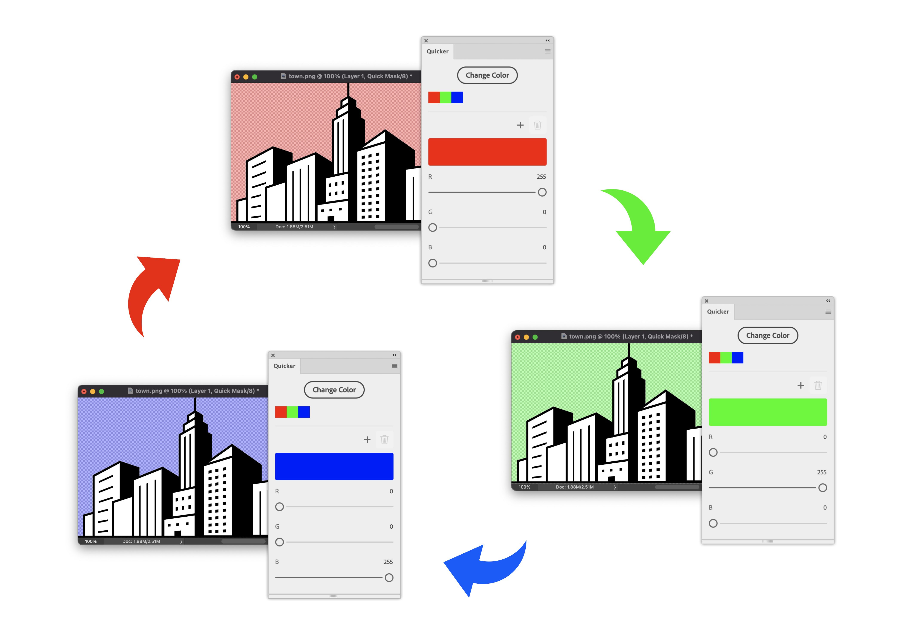
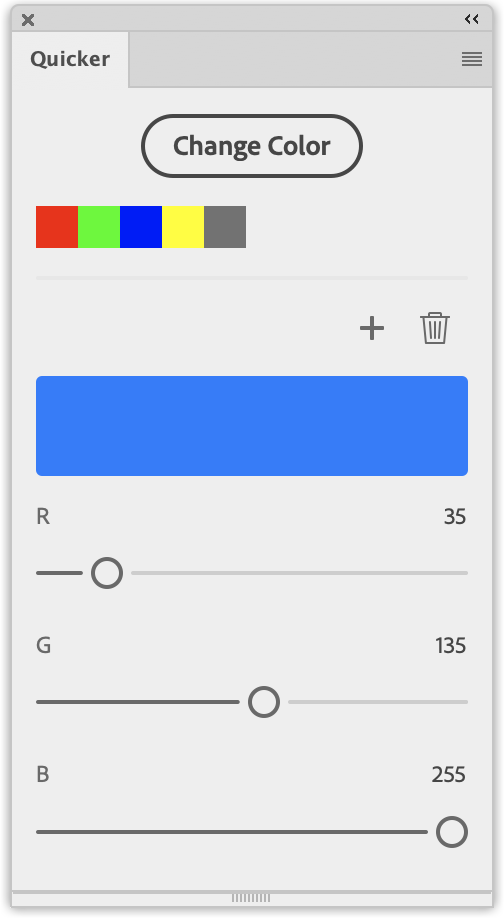
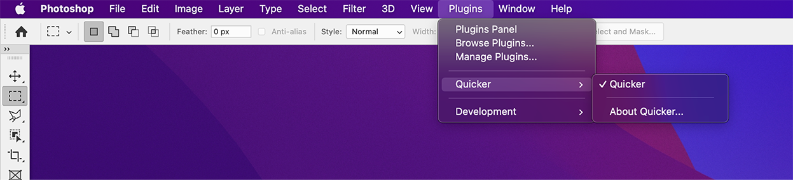
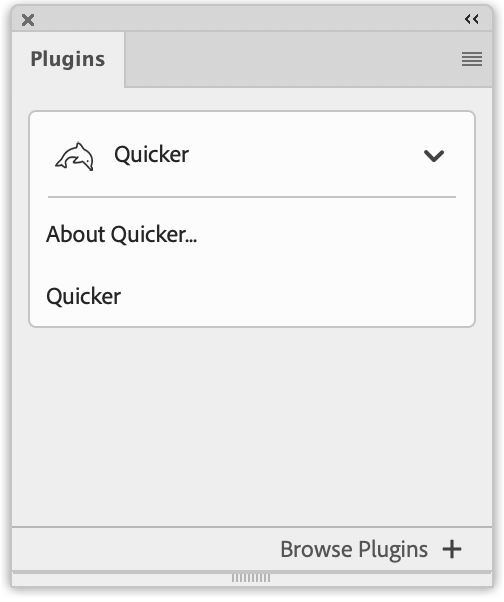
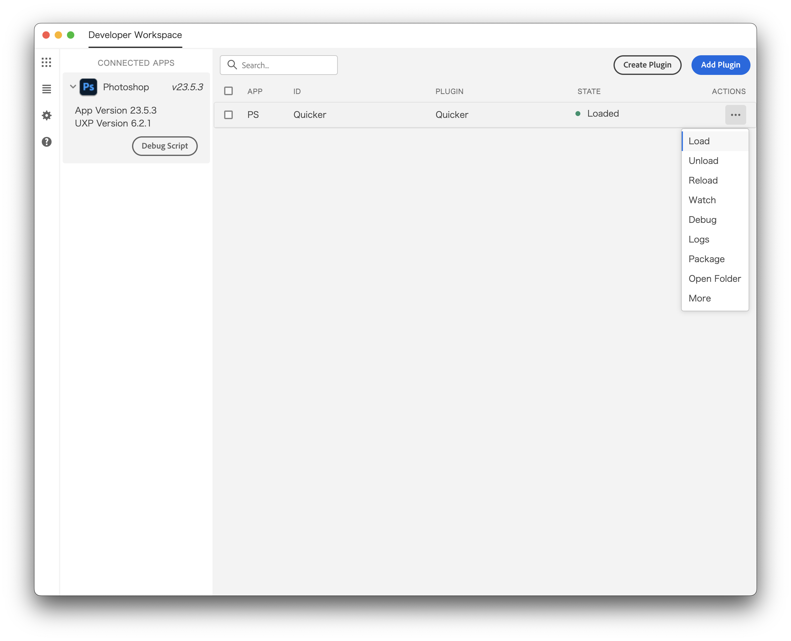
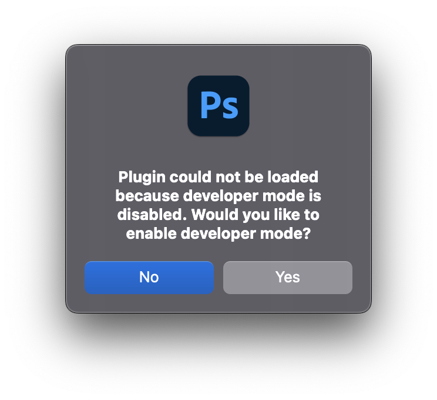
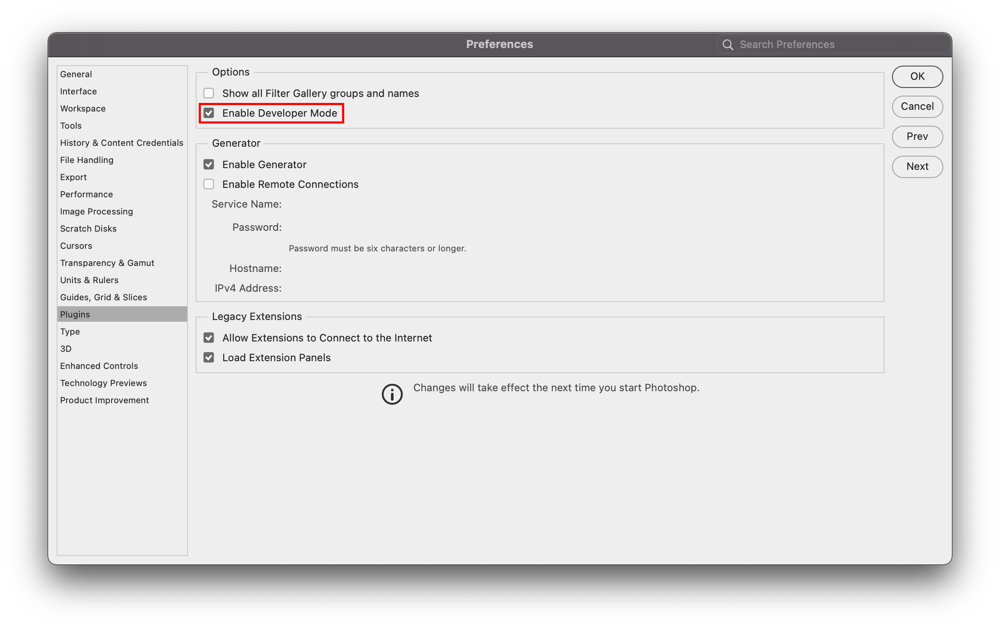

# Quicker

There are too many steps to change a mask color. That is where this plugin comes in.  
This plugin allows you to change the quick mask color and an alpha channel color with one click.

## Usage
To change a color, click the Change Color button when in Quick Mask mode or when an alpha channel is displayed.  
You can also change the color by clicking on the color list below the Change Color button.

Click the Plus icon to add a color that is set in the color picker.  
Click the Trash box icon to delete a color from the color list.

> **Note**  
> The maximum number of colors that can be added to the color list is 10.  
> The default 3 colors(red, green, and blue) cannot be deleted.  
> Colors added to the color list cannot be edited.

> **Warning**  
> When you quit Photoshop, the color list will be reset.  
> When you leave Quick Mask mode, it will return to the default color.

## Installation
  
Download the zip archive and unzip it.  
To install a `Quicker_PS.ccx` file into Photoshop, double click it.  
You will get a warning because it has not been reviewed by Adobe, but you can proceed with the installation without any problems.  
If you are unsure, refer to the following [Build](#build) and use the UXP Developer Tool.

**See also:** [Packaging Your Plugin](https://developer.adobe.com/photoshop/uxp/2022/guides/distribution/packaging-your-plugin/).

After successful installation, it will appear in the Plugins menu and the Plugins panel.

### Requirements
Photoshop 2022(23.3.0) or higher.

## Build
Install dependencies with `npm install`, and then `npm run build` or `npm run watch` will build the plugin and place it in `dist`.

### Launching in Photoshop
You can use the UXP Developer Tool to load the plugin into Photoshop.

If the plugin hasn't already been added to your workspace in the UXP Developer Tool, you can add it by clicking "Add Plugin..." and selecting `dist/manifest.json`.  

Once added, you can load it into Photoshop by clicking the `•••` button on the corresponding row, and click "Load". 
Switch to Photoshop and you should see the Quicker panel.

**See also:** [Adobe UXP Developer Tool](https://developer.adobe.com/photoshop/uxp/2022/guides/devtool/).

If the following warning appears, check the "Enable Developer Mode" checkbox in the Preferences and restart Photoshop. Then click "Load" again.

## License
This plugin is licensed under the MIT license.  
See the included LICENSE file for more details.  
